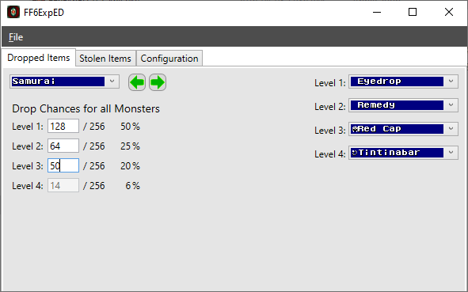
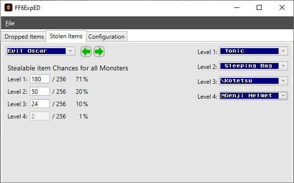
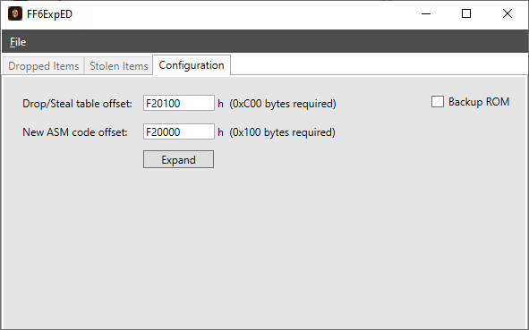

# FF6ExpED 0.2

## Introduction

This small Final Fantasy 6 (FF3us) C#/WPF editor allow to expand and edit dropped/stolen items by monsters. It was my first step in the WPF world in 2016 and at that point I had a few years of academic experience in WinForms and C# console apps. I had plan for a bigger FF6 editor handling more expansions, but projects like [FF6Tools](https://github.com/everything8215/ff6tools) made me rethink my priorities and going beyond v0.2 with FF6ExpED was eventually put on ice.

## Description

There is now 4 possible drops and items to steal per monster, with each an universal odd of dropping from 0/256 to 256/256. You can modify the universal odds of drop and steal. note that the original odd is 7/8 for the common item and 1/8 for the rare one. Assigning item `0xFF` (255) is same thing as assigning nothing, like in [FF3usME](https://www.romhacking.net/utilities/86/).

All drop/steal chances added together must equal 256/256 or 100%. Drop lvl 4 is automatically ajusted. The original dropped/stolen items have been put in slot 1 and 2. Slot 3 and 4 have nothing by default.

Concerning the stolen items, I did not modified the steal formula. Like in vanilla game, percentages are taken into account when you get a successful steal, otherwise it's a failed steal attempt. The editor code and table expansion work with Imzogelmo's [Multi-Steal Fix](https://www.angelfire.com/al2/imzogelmo/patches.html) or without it. However, chance to mess things up are good if you apply the patch (for v1.0) after doing the expansion with the editor. I have not tested this.

If you want only 3 dropped/stolen items, you need to put dropped item 1, 2 or 3 at 0% and leave drop 4 as your third drop. The code is not made for total of first three drops to be beyond `0xFF` (255).

You ROM must be expanded to at least 28Mbit in order to use the editor. The editor does not expand the ROM. The reason being that 0xC00 bytes are required for the new drop/steal table so it needs to go in expanded ROM. There is also 0x100 bytes reserved for actual and future extra code, but the v0.2 code is actually less than that.

## Screenshots








## Drop/Steal Examples
```
0x00 25%
0xFF 25%
0xFF 40%
0x2C 10%
-65% nothing, 25% dirk, 10% item $2C
```

```
0xFF 75%
0x00 24%
0x34  0%
0x00  1%
-75% nothing, 25% dirk
```

```
0xFF 25%
0xFF 25%
0xFF 25%
0xFF 25%
-100% nothing
```

## Extra information

The file [hack.asm](asm/hack.asm) contains a partial version of the code changes for reference only, excluding the steal hack and relocation of the drop/steal table. The file can be assembled with [xkas 0.06](https://www.romhacking.net/utilities/269/). The classes `ByteUtils.cs` and `Rom.cs` have been taken from the open source FF6 editor [ZoneDoctor v3.8.4](https://www.romhacking.net/utilities/678/) and have been modified for the purpose of this project. All the code in the `library/WriteableBitmapExt` folder has been taken from the [WriteableBitmapEx](https://github.com/reneschulte/WriteableBitmapEx) library.

## Known bugs

- Backup option does not work. Ignore it.
- The four percentages in the editor can sometimes add up to 101% because of rounding, but the raw odds in the code and ROM are always correct.

